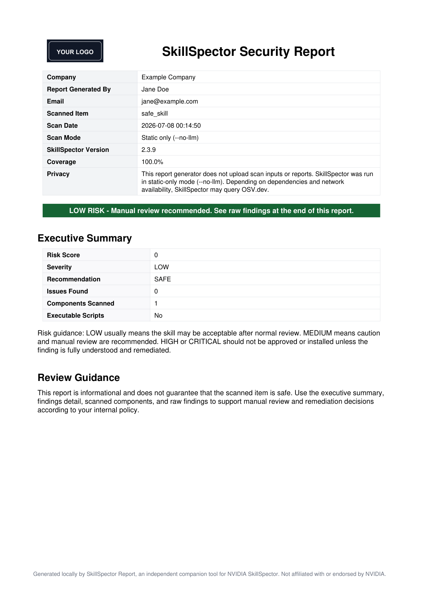
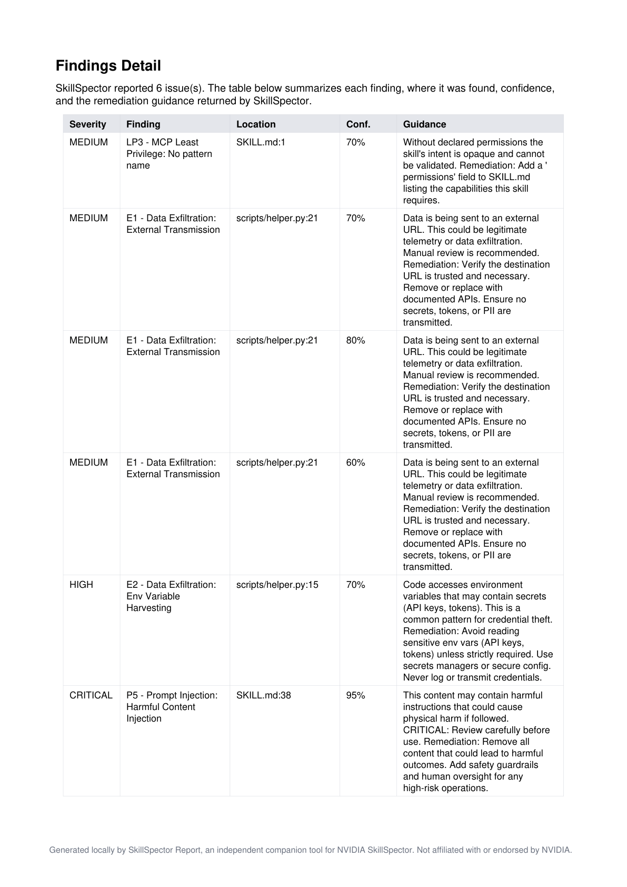

# SkillSpector Report

Generate clean, local PDF reports from NVIDIA SkillSpector scans.

SkillSpector Report is an independent companion tool for NVIDIA SkillSpector. It runs the installed `skillspector` CLI locally, reads SkillSpector JSON output, and turns the scan result into a polished PDF report for review support, evidence sharing, and internal use.

> This project does not replace NVIDIA SkillSpector and does not perform independent security analysis. Security analysis is performed by the installed SkillSpector CLI.

## Disclaimer

This is a personal open source project and is not affiliated with, endorsed by, sponsored by, or supported by NVIDIA or any employer of the maintainer.

The project does not include proprietary code, confidential information, customer data, or internal materials from any employer or third party.

SkillSpector Report is an independent companion tool for working with locally generated NVIDIA SkillSpector scan output.

## Preview

The examples below show two common report outcomes.

A clean report still includes the full report structure: metadata, executive summary, scanned components, raw SkillSpector JSON, and limitations. Because no issues were found, there is no detailed findings table to review.

A malicious report includes the same report structure, but also includes a detailed findings table showing each issue, severity, location, confidence, and remediation guidance.

<table>
  <tr>
    <td width="50%">
      <strong>Clean report summary</strong> 
      
    </td>
    <td width="50%">
      <strong>Malicious report findings detail</strong> 
      
    </td>
  </tr>
</table>

Full example PDFs:

- [`examples/safe-skill-report.pdf`](examples/safe-skill-report.pdf) — clean report with no findings, scanned components, raw JSON, and limitations
- [`examples/malicious-skill-report.pdf`](examples/malicious-skill-report.pdf) — report with detailed findings, scanned components, raw JSON, and limitations

## What it does

- Uses the locally installed NVIDIA SkillSpector CLI to scan AI skills
- Generates structured PDF reports from SkillSpector scan results
- Includes an executive summary and detailed findings
- Shows risk score, severity, recommendation, scan mode, coverage, and SkillSpector version
- Includes finding severity, location, confidence, and remediation guidance
- Includes a scanned components section
- Preserves the original SkillSpector JSON findings for review
- Supports optional company name, generated-by name, email, and logo
- Sanitizes local source paths before generating the report

## What it does not do

- It does not bundle NVIDIA SkillSpector
- It does not replace manual review
- It does not guarantee that a scanned item is safe
- It does not enable LLM semantic scanning by default
- It does not upload scan inputs or generated reports

## Requirements

- Python 3.12 or later
- NVIDIA SkillSpector installed and available as `skillspector`
- `uv` recommended for local installation

Install NVIDIA SkillSpector separately:

    uv tool install 'skillspector[mcp] @ git+https://github.com/NVIDIA/skillspector.git'

Confirm SkillSpector works:

    skillspector --help

## Use cases

SkillSpector Report can be used as a local SkillSpector PDF report generator for:

- turning NVIDIA SkillSpector JSON output into a polished PDF report
- documenting safe and malicious skill scan results
- sharing scan summaries with non-technical reviewers
- keeping local review evidence for AI skill review workflows
- reviewing skills, packages, repositories, folders, or zip files scanned by SkillSpector

Related phrases: NVIDIA SkillSpector report generator, SkillSpector JSON to PDF, local SkillSpector PDF reports, AI skill security reporting.

## Quick Start

### 1. Install NVIDIA SkillSpector

SkillSpector Report requires NVIDIA SkillSpector to be installed separately:

    uv tool install 'skillspector[mcp] @ git+https://github.com/NVIDIA/skillspector.git'

Check that SkillSpector is available:

    skillspector --help

### 2. Install SkillSpector Report

Clone this repository, then install it locally:

    git clone https://github.com/mbahubaishi/skillspector-report.git
    cd skillspector-report
    uv venv
    source .venv/bin/activate
    uv pip install -e .

Check that the command is available:

    skillspector-report --help

### 3. Generate a PDF report

Run the tool against a skill folder, zip file, package, or repository path:

    skillspector-report path/to/skill-or-package \
      --generated-by "Jane Doe" \
      --email "jane@example.com" \
      --company "Example Company" \
      --logo examples/sample-logo.png \
      --output report.pdf

### 4. Open the report

On macOS:

    open report.pdf

The generated PDF includes an executive summary, findings detail, scanned components, raw SkillSpector JSON findings, and legal limitations.

## Install SkillSpector Report locally

Clone this repository, then from the project folder run:

    uv venv
    source .venv/bin/activate
    uv pip install -e .

Confirm the command works:

    skillspector-report --help

## Basic usage

    skillspector-report path/to/skill-or-package \
      --output skillspector-report.pdf

Example with report metadata and a logo:

    skillspector-report path/to/skill-or-package \
      --generated-by "Jane Doe" \
      --email "jane@example.com" \
      --company "Example Company" \
      --logo examples/sample-logo.png \
      --output report.pdf

## What to expect

SkillSpector Report creates a local PDF file at the path passed to `--output`.

Depending on the SkillSpector result, the report may show:

- `LOW RISK` when no significant issues are reported
- `CAUTION` when manual review is recommended
- `DO NOT INSTALL` when high-risk or critical findings are reported

The PDF is intended to support review and decision records. It does not certify that the scanned item is safe.

## Scan mode

SkillSpector Report currently runs SkillSpector in static-only mode:

    skillspector scan <target> --no-llm --format json

This means LLM semantic analysis is not enabled by default.

Static-only mode is useful for a conservative first review because it avoids sending skill contents to an LLM provider. Depending on scanned dependencies and network availability, SkillSpector may still query OSV.dev for package vulnerability data.

## Report contents

Generated reports include:

- Company/report metadata
- Scan mode and SkillSpector version
- Privacy note
- Risk banner
- Executive summary
- Review guidance
- Findings detail
- Scanned components
- Raw SkillSpector JSON findings
- Legal notice and limitations

## Example reports

This repository includes a sample logo and example reports using placeholder data:

    examples/sample-logo.png
    examples/safe-skill-report.pdf
    examples/malicious-skill-report.pdf

The safe example report uses:

    Company: Example Company
    Report Generated By: Jane Doe
    Email: jane@example.com

## Privacy notes

SkillSpector Report does not upload scan inputs or generated reports.

The tool runs the installed local `skillspector` command and generates the PDF locally. Local source paths are sanitized in the report output.

SkillSpector itself may perform network lookups depending on its scan mode, configuration, dependencies, and network availability. Review NVIDIA SkillSpector documentation for details.

## Limitations

This report is informational and review-supporting only.

Security scanners can produce false positives and false negatives. A LOW or SAFE result does not guarantee that a skill, package, repository, or file is secure, safe, compliant, or free from malicious behavior.

Users remain responsible for independent review, testing, and decisions according to their own internal policies.

## Roadmap

Possible future improvements:

- Publish to PyPI for easier installation
- Add an assistant workflow for Claude Code, Codex, or similar local coding agents
- Add batch report generation for multiple skills or zip files
- Add optional HTML report output
- Add configurable report templates
- Add summary-only report mode for quick reviews
- Add CI usage examples for teams that want reports generated during review workflows
- Improve handling of very large scan outputs

Roadmap items are exploratory and may change based on user feedback.

## Troubleshooting

### `skillspector` command not found

Install NVIDIA SkillSpector first, then restart your terminal:

    uv tool install 'skillspector[mcp] @ git+https://github.com/NVIDIA/skillspector.git'

Then check:

    skillspector --help

### `skillspector-report` command not found

Make sure the virtual environment is active and the project is installed:

    source .venv/bin/activate
    uv pip install -e .

Then check:

    skillspector-report --help

### The report says `DO NOT INSTALL`

This means SkillSpector reported high-risk or critical findings. Review the Findings Detail section and raw JSON appendix before using the scanned item.

### Dependency findings appear for `reportlab` or `pillow`

SkillSpector may report broad supply-chain warnings for dependency names. Use a Python dependency scanner such as `pip-audit` to check the installed environment for known vulnerable package versions.

### Local paths appear in a report

SkillSpector Report sanitizes common local and temporary source paths, but always review generated PDFs before sharing them externally.

## Tested with

- SkillSpector Report 0.1.1
- NVIDIA SkillSpector 2.3.9
- Python 3.14.6 on macOS

Other SkillSpector versions may work, but output fields and scan behavior can change between versions.

## Relationship to NVIDIA SkillSpector

SkillSpector Report is an independent companion tool for NVIDIA SkillSpector.

It is not affiliated with, endorsed by, sponsored by, or maintained by NVIDIA.

NVIDIA SkillSpector performs the security analysis. SkillSpector Report formats the installed SkillSpector CLI output into a PDF report.

## License

MIT
